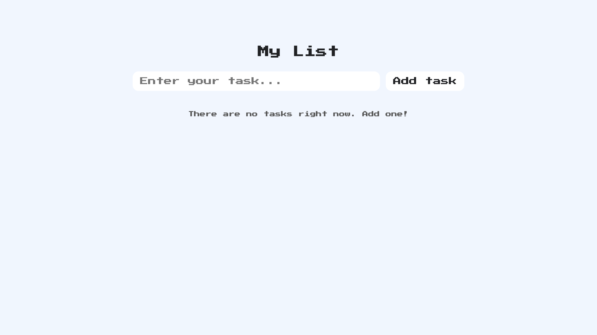
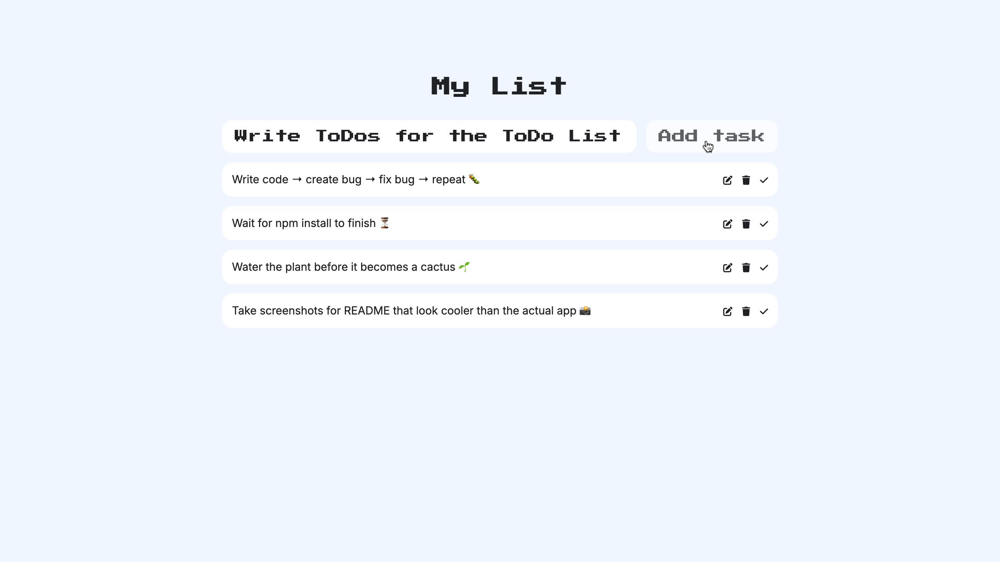

# To-Do List App 📝

This To-Do List App is a simple and clean task-management application built to help users organize their daily activities.  
This project demonstrates core frontend development skills, such UI organization, state handling (locally), and responsive design — all without the need for a backend.

## 🖼️ Screenshots / Demo





This project highlights my ability to:

- Build interactive and user-friendly interfaces
- Work with JavaScript logic for adding, removing, and marking tasks
- Organize code in a clean and maintainable structure
- Create small but polished frontend applications
- Implement responsive layouts that work on different devices

---

## Features ✨

- Add new tasks
- Edit tasks
- Mark tasks as completed
- Remove individual tasks
- Clean and minimal UI

---

## Technologies Used 🛠️

- **HTML5**
- **CSS3**
- **JavaScript**

---

## How to Run the Project ▶️

1. Clone the repository:
   ```bash
   git clone <repository-url>
   ```
